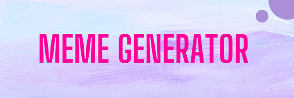

# About the project
   
   This is an interactive reactjs web app to create meme of your choice 

   
   

## components 
 App consist of 2 components 
  --Header.js
  --Meme.js

 
  
 

### this web app makes use of API

## Contributing 
   Pull Requests are welcome and appreciated. For major changes, please open an issue to discuss what improvement you would like to bring in.

### How to contribute 
  you can clone this repo on your device by using this command 
   -- $git clone https://github.com/apala7778/Meme-Generator

   -make changes and test.
   -submit PR with comprehensive description of changes you've made.

   
